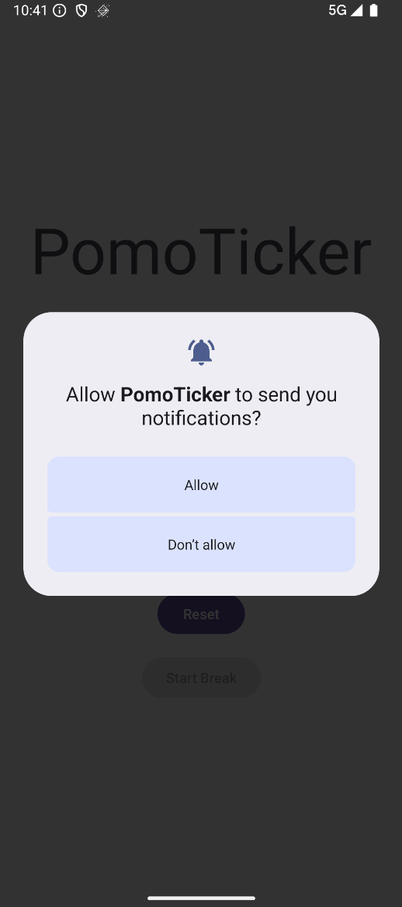
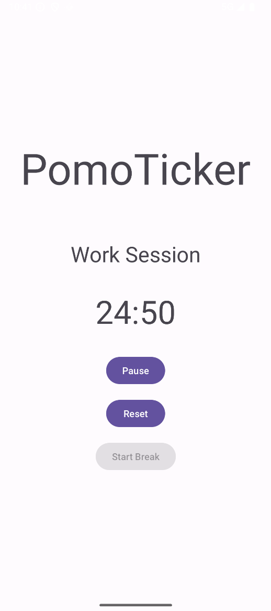
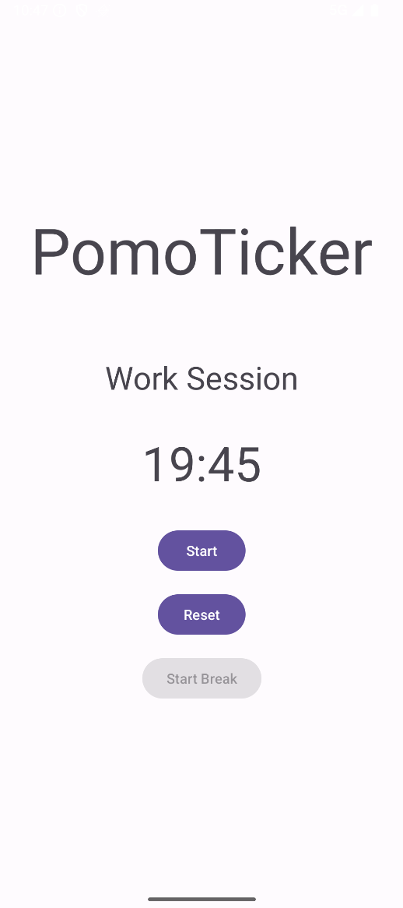
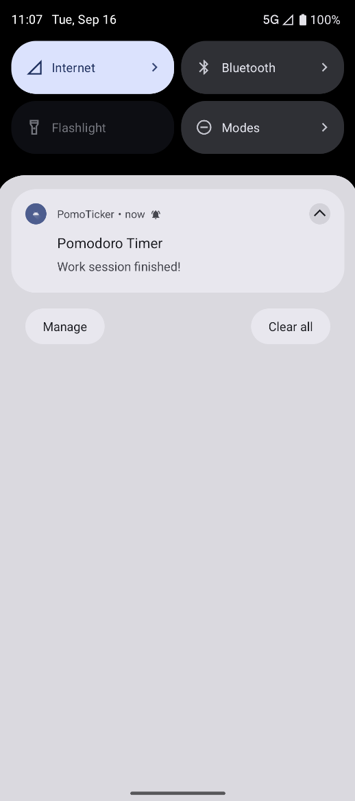
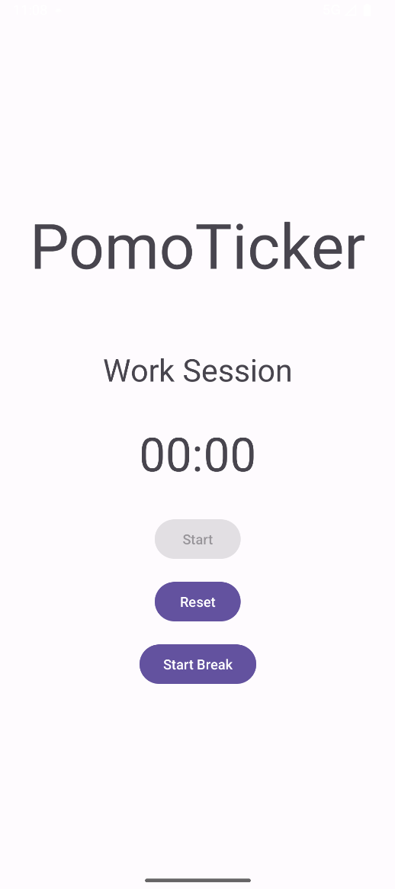
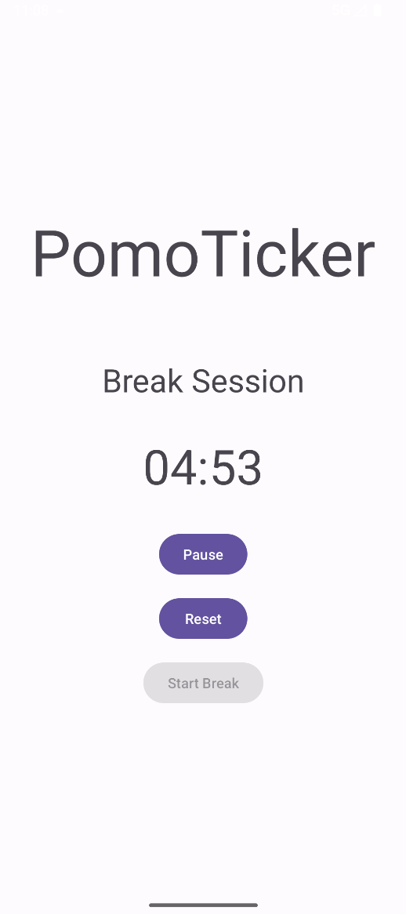
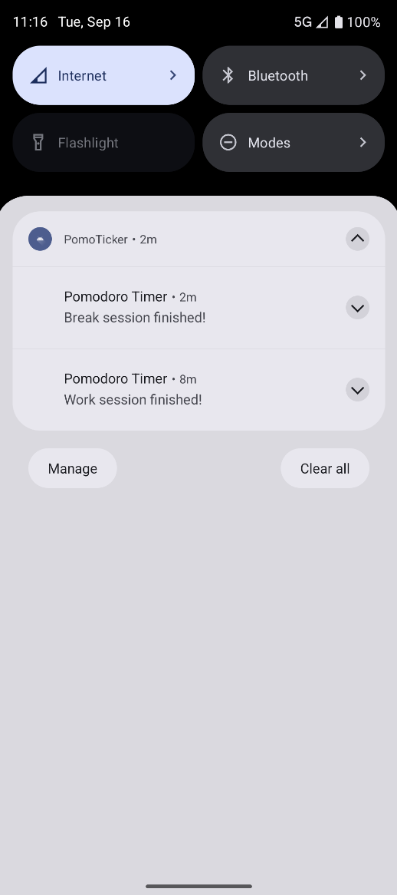

# PomoTicker
PomoTicker is a simple Pomodoro timer Android application that helps you manage your work and break intervals for better productivity.

## Features
- 25-minute work timer
- 5-minute break timer after each work session
- Start, pause, and reset functionality
- Notifications when a session ends

## Screenshots

  
  
  
  
  
  
  
  
  

## Usage
- Press Start to begin a 25-minute work session.
- When the timer ends, the button for a 5-minute break timer will be available.
- Use Pause or Reset as needed.

## Technologies
- Java/Kotlin
- Android SDK
- Gradle